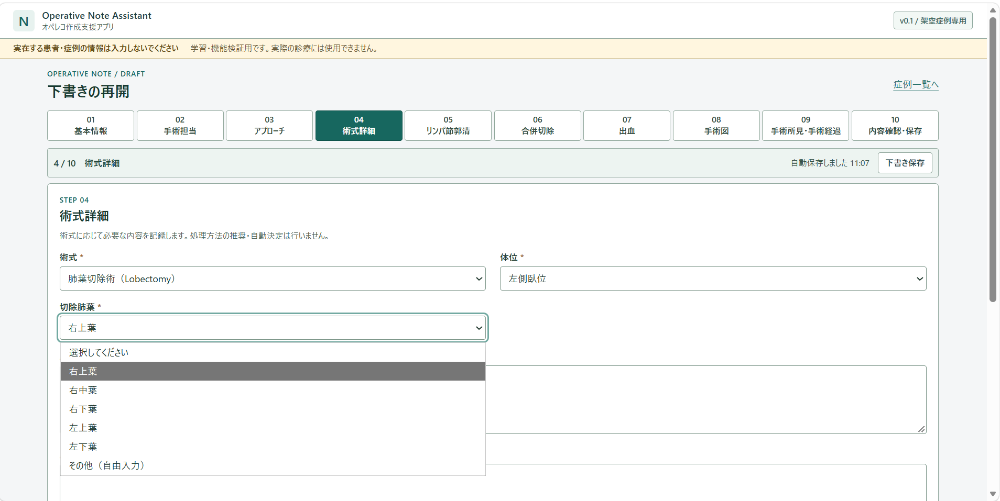
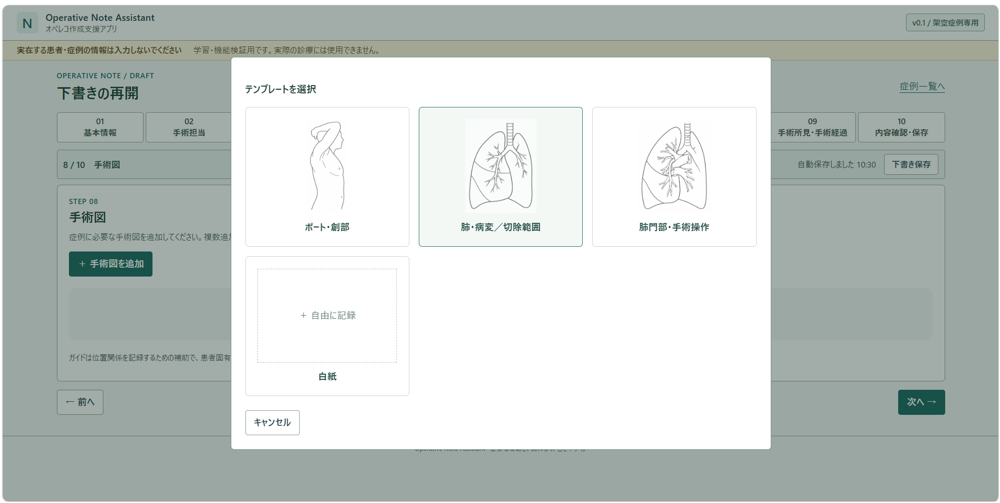
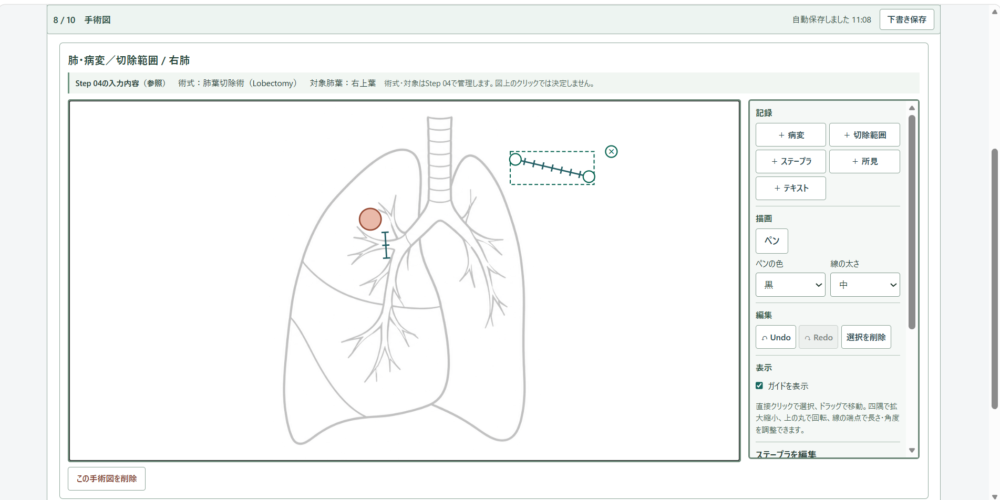
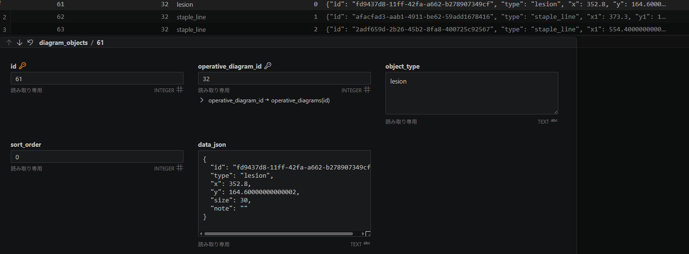

# Operative Note Assistant v0.1

**オペレコ作成支援アプリ — 必要な情報を、漏れなく、書きやすく —**

> **現在開発中のプロトタイプです。**  
> v0.1では、基本的な入力項目に範囲を絞り、手術記録の入力方法と手術図（イラスト）作成機能の基本的な仕組みを実装しています。

## 概要

Operative Note Assistantは、手術記録（オペレコ）の作成を支援するWebアプリケーションです。

手術記録に必要な情報を、その性質に応じて次の3つの方法で記録できる構成としています。

- **基本情報 → 入力項目**
- **手術操作 → 手術図（イラスト）**
- **手術経過 → フリーフォーマット**

v0.1では、架空の肺癌手術をモデルケースとして、手術記録の作成、下書き保存・再開、手術図の作成・編集、内容確認、完成保存までを実装しています。

---

## 医療情報・守秘義務について

本アプリの開発には、**実在する患者・症例・手術記録のデータは使用していません。**

医療分野での実務経験から得た問題意識を着想の背景としていますが、実務で扱った患者情報、手術記録、院内資料、院内システムの画面・仕様、実在する医療従事者情報等は一切使用していません。

また、実在する医療情報を匿名化・加工したデータも使用しておらず、アプリ内の症例データはすべて機能検証のために作成した架空のデモデータです。

本アプリは学習・ポートフォリオ目的のプロトタイプであり、**実際の医療情報を扱う用途には使用できません。**

---

## 主な設計

### 手術図をアプリ内で作成・記録する

基本情報や手術経過の入力だけでなく、手術図（イラスト）も同じアプリ内で作成できます。

手術図では、次の2つの方法を組み合わせて記録できます。

- **自由描画**：ガイドを参考にしながら、ペンで自由に描画
- **アイコン・図形**：病変、切除範囲、Staple Line、Energy Deviceなどを種類ごとに配置

ガイドは必要に応じて非表示にでき、白紙から自由に描くこともできます。

#### イラスト上の情報を「意味のあるデータ」として記録する

アイコンや図形は、イラスト上では図形として表示されますが、それぞれが「何を記録したものか」というデータ上の意味を持っています。

| イラスト内 | データ上の意味 | 保存する情報の例 |
| --- | --- | --- |
| 病変 | `lesion` | 位置、図上サイズ、メモ |
| 切除範囲 | `resection_area` | 位置、形状 |
| Staple Line | `staple_line` | 始点、終点 |
| Energy Device | `energy_device` | 位置、種類、メモ |
| 所見 | `finding` | 位置、所見内容 |
| テキスト | `text` | 位置、文字列 |
| 自由描画 | `freehand` | 描画した線、色、太さ |

**【例】**　イラストに配置した「病変」は単なる丸い図形ではなく、`lesion`という意味を持つデータとして保存されます。

手術図を一枚の画像として保存するのではなく、図上の情報を個別のデータとして記録することで、保存後もそれぞれの要素を再表示・再編集できる構成としています。

自由に描ける部分を残しながら、図上の情報の一部を意味のあるデータとして記録することを意図した設計です。

### 入力途中でも保存・再開できる

手術記録の作成中に、急な対応などで入力を中断する場面を想定し、完成保存とは別に下書きとして保存できるようにしています。

入力内容は自動保存され、症例一覧から下書きを開いて続きから入力できます。下書きでは必須項目が未入力でも保存でき、完成保存時に必要な項目を検証します。

記録は `draft`（下書き）と `completed`（完成）を区別して管理しています。

---

## 開発背景

手術記録には、手術日や術式などの基本情報に加え、症例ごとに異なる手術所見や術中経過、手術図など、多くの情報を記録する必要があります。

- 医師によって記載内容や表現に違いが生じやすい
- 多くの情報を文章として入力する必要があるため、必要な情報が文章の中に埋もれやすい
- 手術図（イラスト）の作成に時間がかかる
- 手書きや別の媒体で作成したイラストを、記録に取り込む作業が生じることがある

そこで、必要な情報を入力画面上にあらかじめ示し、**「基本情報の入力」「手術図の作成」「手術経過の記録」を一つのアプリ内で行える**ようにすることで、記載のばらつきと記録作成の負担を減らせないかと考えました。

**「入力を標準化しながら、症例ごとの自由度を失わない。」**

この考え方をもとに、Operative Note Assistantを作成しました。

---

## 画面フロー

入力内容を10のステップに分けています。

| Step | 内容 |
| --- | --- |
| 01 | 基本情報・開始／終了時刻・手術時間 |
| 02 | 手術担当（複数の術者・助手、麻酔） |
| 03 | アプローチ |
| 04 | 術式詳細・体位・切除肺葉／区域切除の対象 |
| 05 | リンパ節郭清 |
| 06 | 合併切除 |
| 07 | 出血量・輸血 |
| 08 | 手術図 |
| 09 | 手術所見・手術経過 |
| 10 | 内容確認・完成保存 |

上部のステップから前後の入力画面へ移動できます。

### 必要な情報を項目ごとに入力

術式や体位など、あらかじめ選択肢を用意できる情報は、項目ごとに入力できるようにしています。



---

## 手術図

手術図（イラスト）機能は現在、試作段階であり、v0.1では基本的な作成・編集機能を実装しています。

Step 08では、症例に応じて複数の手術図を追加し、同じ画面上で編集できます。

### テンプレート

記録する内容に応じてテンプレートを選択して追加できます。ガイドを使用せず、白紙から記録することもできます。



| テンプレート | ガイド | 主な記録ツール |
| --- | --- | --- |
| ポート・創部 | 左側臥位／仰臥位／右側臥位 | ポート、切開線、所見、テキスト、自由描画 |
| 肺・病変／切除範囲 | 右肺／左肺 | 病変、切除範囲、Staple Line、所見、テキスト、自由描画 |
| 肺門部・手術操作 | 右肺門／左肺門 | Staple Line、Energy Device、所見、テキスト、自由描画 |
| 白紙 | なし | 各記録ツール |

同じ種類の手術図を複数追加することも、手術図を作成せず次のステップへ進むこともできます。

ガイドは図ごとに表示・非表示を切り替えられます。ガイドを非表示にしても、追加した記録内容は保持されます。

### 手術図の作成・編集

病変やStaple Lineなどをアイコン・図形として配置できるほか、自由描画で症例に応じた内容を記載できます。
テンプレートのガイドは表示・非表示を切り替えることができ、白紙から自由に記載することもできます。



- 配置したアイコンや図形は、選択・移動・サイズ変更・回転・長さや角度の調整など、種類に応じた編集ができます。自由描画と組み合わせて記録することもできます。
- 自由描画では色と線の太さを選択でき、Undo／Redoにも対応しています。
- アイコンや図形は、図上の位置や属性とともに保存され、下書きを再開した際にも再表示・再編集できます。

**イラスト上ではアイコンや図形として表示されますが、DBではそれぞれが「病変」「Staple Line」などの種類を持つデータとして記録されます。**



上図は開発用の架空データをSQLiteで確認した例です。手術図上の各要素は、種類と属性を持つデータとして保存されます。

Staple LineやEnergy Deviceの表示は本アプリ内で使用するUI表現であり、医学的な標準記号を示すものではありません。また、図上のStaple Line数を実際のカートリッジ使用本数として自動的に扱うことはしていません。

手術図のガイドは記録作成を補助するためのものであり、患者固有の解剖を示すものではありません。

---

## 主な機能

- 10ステップによるガイド型入力
- 選択内容に応じた条件付き入力
- 複数の術者・助手の記録
- 開始・終了時刻からの手術時間計算
- リンパ節郭清、合併切除、出血量・輸血等の記録
- 手術所見・手術経過の自由記載
- 複数の手術図の作成・編集
- イラスト上のアイコン・図形と自由描画
- 自動下書き保存・手動下書き保存
- 下書きからの入力再開
- 完成時の必須項目チェック
- `draft`／`completed` 状態管理
- 症例一覧・詳細表示

---

## 使用技術

| 分類 | 技術 |
| --- | --- |
| Backend | Python 3.12 / Flask |
| Database | SQLite（標準 `sqlite3`） |
| Template | Jinja2 |
| Frontend | HTML / CSS / Vanilla JavaScript |
| Diagram | SVG |
| Test | pytest |

v0.1の規模と学習目的を考慮し、React、Vue、SQLAlchemy、pandas等は使用せず、Python・Flask・SQLite・JavaScriptそれぞれの役割を確認しやすい構成としています。

---

## AIツールの活用

- **ChatGPT**：要件・設計の検討、コード理解、README等のドキュメント整理に活用
- **Codex**：実装・コードレビュー・テストなどの開発支援に活用

AIは本アプリの機能としては組み込んでおらず、医療情報を外部のAIサービスへ送信する機能も実装していません。

---

## データベース

SQLiteを使用し、v0.1では以下の3テーブルで構成しています。

| テーブル | 用途 |
| --- | --- |
| `operative_notes` | 手術記録・下書き／完成状態 |
| `operative_diagrams` | 手術図ごとの状態 |
| `diagram_objects` | 手術図上に配置したオブジェクト |

術者・助手・リンパ節などの複数値はJSON配列として保存しています。

手術図上の病変、切除範囲、Staple Line、Energy Device、自由描画なども、種類と属性を持つデータとして保存し、下書き再開時に再表示・再編集できる構成としています。

---

## ファイル構成

```text
operative-note-assistant/
├── app.py
├── db.py
├── fields.py
├── diagram_specs.py
├── validation.py
├── templates/
├── static/
├── docs/
│   └── images/
├── tests/
├── requirements.txt
├── .gitignore
└── README.md
```

実行時にSQLite DBが作成されます。

DB、仮想環境、キャッシュ、`.env`、ログ、一時ファイル等はGit管理対象外です。

---

## 安全性と制限事項

v0.1では、医療情報を扱わない学習用プロトタイプとして、以下の点に配慮しています。

- 本アプリの目的に不要な患者個人情報の入力項目を設けない
- 症例IDを `DEMO-001` 形式に制限
- 術者・助手等は架空の選択肢のみ使用
- 画面上に実在情報を入力しないよう注意を表示
- SQLite DBをGit管理対象から除外
- `.env`、仮想環境、キャッシュ等をGit管理対象から除外
- 秘密情報・認証情報をコードに保持しない
- CSV・Excel出力を実装しない
- 外部API・AIサービスへの医療情報送信を実装しない

入力値の検証、Jinja2の自動エスケープ、SQLプレースホルダー、CSRF対策等を使用しています。

また、手術図を同じアプリ内で作成する構成とし、記録作成のために別の描画サービスへ情報を受け渡す必要性を減らすことを意図しています。

ただし、これらの設計だけで安全性を保証するものではありません。

自由記載欄には任意の文字列を入力できるため、実在情報を自動的に検出・匿名化する機能はありません。

また、本アプリはローカル環境での学習・機能検証を目的としたプロトタイプであり、以下は対象外です。

- 実際の患者情報の保存
- 認証・権限管理
- 実運用向け監査ログ
- DB暗号化
- 運用バックアップ
- 完成後の記録編集
- 電子カルテ連携
- NCD連携
- CSV・Excel出力
- 外部API・AIサービスへの医療情報送信
- 医学的判断
- 術式・処理方法の推奨
- AIによる解剖認識・手術図生成

また、v0.1では区域名の固定マスタ、自由描画の消しゴム、切除範囲等の頂点単位での高度な編集は実装していません。

**実際の医療情報を扱う用途には使用できません。**

---

## テスト

pytestを使用し、本体DBとは別の一時DBでテストしています。

```powershell
.\.venv\Scripts\python.exe -m pytest -q
```

最終UX改修を含め、**151 tests passed** を確認しています。

主に以下を検証しています。

- 入力値の検証
- 自動・手動下書き保存
- 下書きからの再開
- 完成保存
- 条件付き入力
- 複数値の保存・復元
- DB移行と既存データの保持
- 複数手術図の保存・再表示
- 図上オブジェクトの編集・削除
- ガイド表示状態の保存
- 旧データとの互換性
- 区域切除の条件付き入力
- 手術所見・手術経過の統合
- 図上の変形属性、ペンの色・太さの保存
- 不正データの拒否
- CSRF対策

ブラウザーでも架空症例を使用し、Step 01から完成保存まで一連の操作を確認しています。

複数の手術図、ガイド表示切替、オブジェクトの移動・拡大縮小・回転、線の端点編集、自由描画、Undo／Redo、保存・再読み込み後の復元まで確認しました。

---

## 今後の課題

v0.1は、オペレコ作成支援の入力方法を検討するためのプロトタイプです。

現在は、基本的な入力項目に範囲を絞って実装しており、実際の手術記録で必要となる入力項目を網羅したものではありません。今後、必要な項目や選択肢について検討しながら追加・整理していく予定です。

また、手術図（イラスト）機能についても、実際の記録作成を支援できる操作性や表現力にはまだ改善の余地があり、今後も試作と検証を重ねながら改善していく予定です。

今後の改善候補

- 入力項目・選択肢の追加と整理
- 術式ごとの入力項目の検討
- 区域名等の入力項目の整理
- 手術図の操作性の改善
- 自由描画・図形編集機能の改善
- 手術図で表現できる記録内容の検討

医学的な選択肢やマスタについては、根拠を確認した上で追加し、実装範囲を無理に広げるのではなく、必要性を確認しながら段階的に改善していく方針です。
