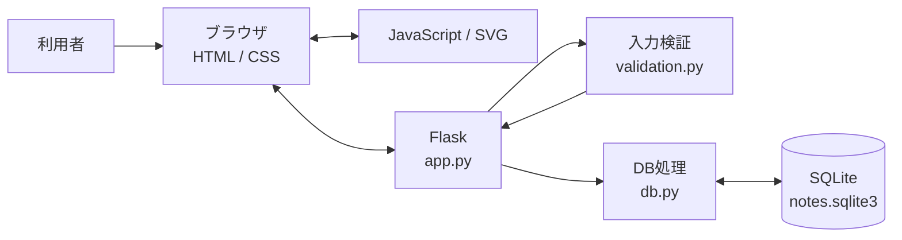
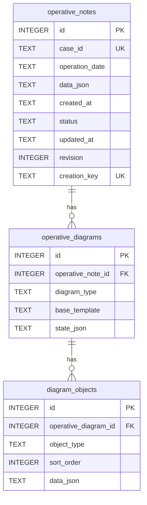
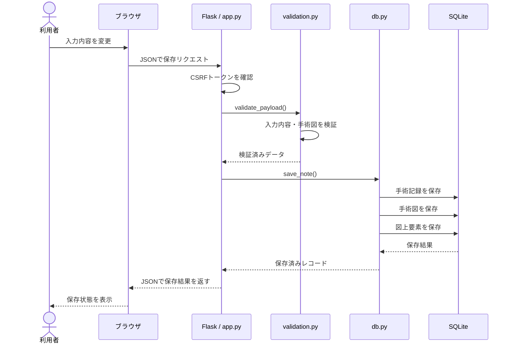

# Operative Note Assistant v0.1 基本設計

## 1. 文書の目的

本書は、Operative Note Assistant v0.1の現在の実装に基づき、システム構成、データ構造、保存処理、手術図の設計等を整理したものです。

Operative Note Assistantは、学習・ポートフォリオ目的で開発している手術記録（オペレコ）作成支援Webアプリケーションです。

本書では、v0.1で実装している構成を対象とします。

## 2. システム全体構成

本アプリは、ブラウザからFlaskアプリケーションへアクセスし、入力された手術記録や手術図のデータをSQLiteへ保存する構成としています。



### 各要素の役割

| 要素 | 主な役割 |
|---|---|
| HTML | 入力画面、確認画面、一覧画面等の構造 |
| CSS | レイアウトや表示デザイン |
| JavaScript | 入力画面の動的処理、自動保存、手術図の操作等 |
| SVG | 手術図上の図形・記録要素の表示 |
| Flask | URLごとの処理、画面表示、保存リクエストの受付等 |
| Python | 入力検証、データ処理、DB処理等 |
| SQLite | 手術記録・手術図・図上要素の保存 |

## 3. 主なPythonファイルの役割

### `app.py`

Flaskアプリケーションの入口として、主に以下を担当します。

- 一覧画面の表示
- 新規入力画面の表示
- 下書きの再編集
- 新規保存
- 更新保存
- 完成した記録の表示
- CSRFトークンの確認
- JSONリクエストの受付
- 入力検証処理の呼び出し
- DB保存処理の呼び出し
- 保存結果のJSONレスポンス
- エラー処理
- セキュリティ関連HTTPヘッダーの設定

### `fields.py`

入力画面で使用する項目を共通定義します。各項目について、項目名、表示ラベル、入力形式、選択肢、必須項目かどうか、表示条件を定義しています。

10ステップの入力構成もこのファイルで定義します。条件付き項目には `when` を設定し、選択内容に応じて必要な項目だけを表示できる構成としています。

### `validation.py`

ブラウザから送信されたデータを、DBへ保存する前に検証します。

主な検証内容は以下です。

- 保存データ全体の形式
- `draft` / `completed` の状態
- 入力ステップ
- 各入力項目の型・文字数・選択肢
- 日付・時刻・症例IDの形式
- 完成保存時の必須項目
- 手術図の構造・枚数
- 図上要素の種類・座標・サイズ・個数・描画点数

下書き保存では入力途中の内容を保持し、完成保存時には必須項目を検証します。また、完成保存時には現在の条件に該当しない入力項目の値を除去し、不要な条件付きデータを完成記録に残さない構成としています。

### `db.py`

SQLiteとの接続およびデータの保存・取得を担当します。

- DB接続・終了
- テーブル作成
- 既存DBからの移行処理
- 手術記録の新規保存・更新
- 手術図・図上要素の保存
- 手術図の再読み込み
- 更新競合の検出

### `diagram_specs.py`

現在の手術図で使用するテンプレートとガイドを定義します。手術図の種類ごとに、表示名、使用可能なガイド、使用可能な図上要素を管理します。

## 4. 画面・入力構成

手術記録は10ステップに分けて入力します。

| Step | 内容 |
|---:|---|
| 01 | 基本情報・開始／終了時刻 |
| 02 | 術者・助手・麻酔 |
| 03 | アプローチ |
| 04 | 術式詳細・体位 |
| 05 | リンパ節郭清 |
| 06 | 合併切除 |
| 07 | 出血量・輸血 |
| 08 | 手術図 |
| 09 | 手術所見・手術経過 |
| 10 | 内容確認・完成保存 |

### 条件付き入力

すべての項目を常時表示するのではなく、選択内容に応じて必要な項目を表示します。

例えば、肺葉切除術を選択した場合には切除肺葉等を入力でき、区域切除術を選択した場合には対象側・対象区域名を入力できます。

これらの表示条件は `fields.py` の項目定義と `field_visible()` を使用して管理します。

## 5. データベース設計

SQLiteデータベースでは、主に以下の3テーブルを使用します。

- `operative_notes`
- `operative_diagrams`
- `diagram_objects`

### テーブル間の関係



1つの手術記録は複数の手術図を持つことができ、1つの手術図は複数の図上要素を持つことができます。

### `operative_notes`

手術記録本体を保存します。症例ID、手術日、入力内容、保存状態、作成日時、更新日時、更新番号、新規保存識別キーを管理し、入力内容の詳細は `data_json` にJSON形式で保存します。

### `operative_diagrams`

手術記録に関連する手術図を保存します。`operative_note_id` により `operative_notes` と関連付け、手術図の種類、ベーステンプレート、手術図全体の状態を管理します。

### `diagram_objects`

手術図上に配置した個々の記録要素を保存します。`operative_diagram_id` により `operative_diagrams` と関連付け、オブジェクト種類、表示順、詳細データを管理します。

病変やStaple Line等を単なる完成画像の一部として保存するのではなく、それぞれ独立したデータとして保存することで、再表示・再編集できる構成としています。

## 6. 保存処理

### 6.1 保存処理の基本フロー

ブラウザから送信されたデータをそのままDBへ保存せず、Flaskでリクエストを受け取った後、入力内容を検証してからSQLiteへ保存します。



検証に失敗した場合はDBへ保存せず、エラー内容をブラウザへ返します。

### 6.2 下書き保存

下書き保存では、入力途中であることを前提とします。そのため、完成保存に必要な項目がすべて入力されていなくても保存できます。下書き時には条件付き項目の作業途中の値も保持し、利用者が入力を再開できるようにします。

### 6.3 完成保存

完成保存では、現在表示対象となっている必須項目を検証します。必要な項目が不足している場合は完成保存しません。また、条件変更によって現在使用されていない項目については、完成保存時に不要な値を除去します。

### 6.4 新規保存と更新保存

新規記録は `POST /notes` で保存し、保存済みの下書きは `PUT /notes/<note_id>` で更新します。

更新時には `revision` を使用し、DB更新を `WHERE id = ? AND revision = ? AND status = 'draft'` の条件で行います。条件が一致した場合に `revision` を1増加させ、一致しない場合は更新競合として扱います。

### 6.5 重複した新規保存への対応

新規保存時には `creation_key` を使用します。同じ `creation_key` による保存要求が再度送信された場合には、新しい手術記録を重複作成せず、既に作成された記録を返します。

## 7. 手術図の設計

### 7.1 基本方針

手術図は単なるイラストではなく、位置や手術操作等を記録するための入力インターフェースとして扱います。

**「入力を標準化しながら、症例ごとの自由度を失わない。」**

手術図では、ガイド、意味を持つ図上要素、自由描画、テキスト・所見を組み合わせて記録できる構成としています。

### 7.2 手術図の種類

| 種類 | ガイド |
|---|---|
| ポート・創部 | 左側臥位 / 仰臥位 / 右側臥位 |
| 肺・病変／切除範囲 | 右肺 / 左肺 |
| 肺門部・手術操作 | 右肺門 / 左肺門 |
| 白紙 | ガイドなし |

### 7.3 図上要素

新形式の手術図では、以下の図上要素を使用します。

- `port`
- `incision`
- `lesion`
- `resection_area`
- `staple_line`
- `energy_device`
- `finding`
- `text`
- `freehand`

利用できる要素は手術図の種類によって異なり、`diagram_specs.py` で定義します。

### 7.4 ガイドと記録データの分離

ガイドは記録位置を把握しやすくするための補助表示として使用します。ガイド自体を患者固有の解剖情報として扱わず、利用者が追加した記録要素とは分けて管理します。

ガイドは表示・非表示を切り替えることができ、非表示にしても図上の記録要素は保持します。

### 7.5 Step 04とStep 08の役割分担

術式や対象肺葉等の定型情報はStep 04で管理します。Step 08の手術図では、それらの情報を参照しながら、位置や手術操作等を図として記録します。

手術図上のクリックによって術式や対象を決定する構成にはせず、定型情報と図による記録の役割を分けています。

### 7.6 手術図データの保存

手術図は完成した画像だけを保存するのではなく、手術図の状態と各図上要素をデータとして保存します。

```text
手術記録
└─ 手術図
   ├─ 図の種類
   ├─ ガイド
   ├─ ガイド表示状態
   └─ 図上要素
      ├─ 病変
      ├─ 切除範囲
      ├─ Staple Line
      ├─ Energy Device
      ├─ 所見
      ├─ テキスト
      └─ 自由描画
```

これにより、保存した手術図を読み込んだ際に、各要素を再構成して編集できます。

## 8. データ保護・安全性に関する設計

### 8.1 CSRF対策

保存リクエストではCSRFトークンを確認し、トークンが一致しない場合は保存処理を行いません。

### 8.2 HTTPレスポンスヘッダー

Flaskからのレスポンスには、以下を含むセキュリティ関連ヘッダーを設定します。

- Content-Security-Policy
- X-Content-Type-Options
- Referrer-Policy
- Cache-Control

### 8.3 Cookie設定

セッションCookieには `HttpOnly` と `SameSite=Strict` を設定します。

### 8.4 保存データサイズ

1回のリクエストサイズは512 KiB以内とします。上限を超えた場合は保存せず、描画点や注記を減らすよう通知します。

### 8.5 入力値検証

入力値はブラウザ側だけでなく、サーバー側の `validation.py` でも検証します。手術図についても、図の枚数、オブジェクト数、オブジェクト種類、座標、サイズ、テキスト長、描画点数等を検証してから保存します。

## 9. 医療情報・守秘義務に関する設計

本アプリでは、実際の患者情報や実務上知り得た情報を保存・公開しないことを前提としています。

- 実務で扱った患者情報を使用しない
- 実務で扱った手術記録を使用しない
- 院内資料を使用しない
- 院内システムの画面・仕様等を使用しない
- 実在する医療従事者の情報を使用しない
- 実在する医療情報を匿名化・加工したデータも使用しない
- 画面構成や入力項目を含め、公開可能な一般情報を参考に独自に設計する
- アプリ内では架空の症例・デモデータのみを使用する

本アプリは実際の医療情報を扱うシステムとして必要となる認証・アクセス制御・監査・暗号化等を備えた実運用システムではありません。

### 9.1 デモデータに限定するための設計

ポートフォリオとして公開するにあたり、実在する医療情報を使用しないため、以下の制約を設けています。

- 症例IDは `DEMO-001` のような `DEMO-` + 半角数字3桁の形式に制限する
- 術者・助手・麻酔担当者は架空の選択肢を使用する
- 画面上に実在する患者情報・医療従事者情報を入力しないよう注意事項を表示する
- 本アプリの目的に不要な患者個人情報の入力項目を設けない

なお、自由記載欄には任意の文字列を入力できるため、実在情報を自動的に検出・匿名化する機能はありません。

## 10. 互換性に関する設計

手術図は現在の新形式に加え、過去に作成した旧形式のデータを読み込めるよう互換処理を残しています。

入力データについても、旧形式で分かれていた「手術所見」と「手術経過」を現在の「手術所見・手術経過」へ読み替える処理を持っています。

これらは既存データを読み込めるようにするための互換処理であり、新規入力では現在の形式を使用します。

## 11. v0.1の制限事項

本アプリは学習・ポートフォリオ目的のプロトタイプです。

現在の主な制限事項は以下です。

- ユーザー認証を実装していない
- 利用者ごとのアクセス制御を実装していない
- 監査ログを実装していない
- 実運用を想定したデータ暗号化を実装していない
- 電子カルテ等の外部システムとは連携していない
- 実際の患者情報を扱うことを想定していない
- 手術図の自由描画には部分消去機能がない
- 切除範囲等の個別頂点編集には対応していない

実際の医療現場で使用するシステムとする場合には、医療情報の取り扱い、認証、アクセス制御、監査、データ保護、バックアップ等を含め、別途要件定義・設計が必要です。
